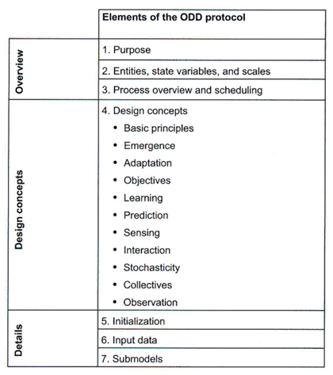
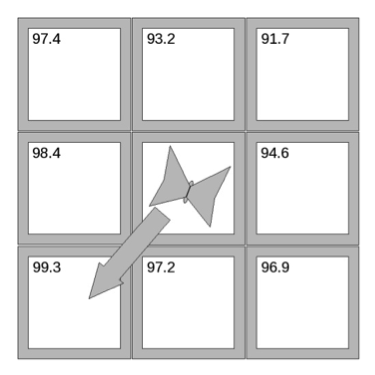
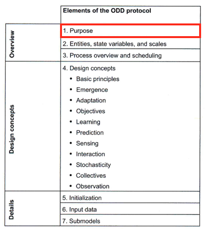
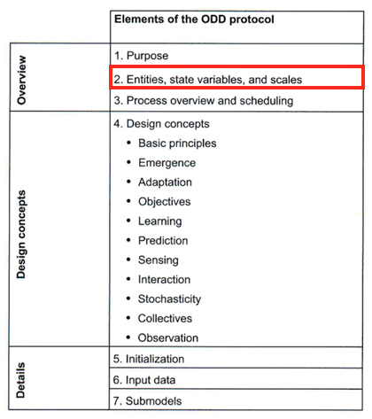
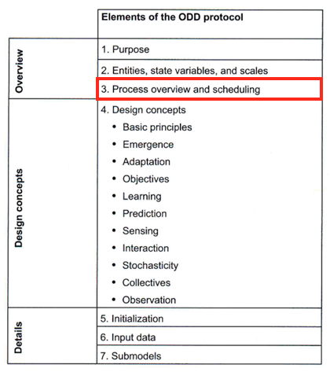
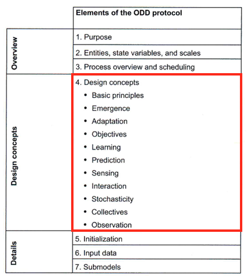
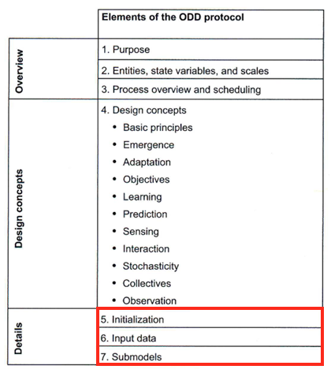

## Class Announcements

:::{.incremental}
 - Please read Chapter 3: Describing and Formulating ABMs: The ODD Protocol
 - Please skim Chapter 4: Implementing a First Agent-Based Model
:::

# The ODD Protocol

**"ODD" = "Overview, Design concepts, and Details"**

## Why ODD?

:::{.incremental}
 * Useful for _describing_ ABMs (**model protocol; standardization**)
 * Useful for _understanding_ ABMs (**multiple model representations**)
 * Useful for _replicating_ ABMs (**model reproducibility**)
 * Useful for _formulating_ ABMs (**modeling roadmap; guides thinking**)
:::

## The ODD Protocol

**"ODD" = "Overview, Design concepts, and Details"**

## Learning Objectives

:::{.incremental}
 * Be able to name the benefits of using a "Materials and Methods" protocol (e.g. ODD) for reporting and organizing the steps of agent-based model design and analysis.
   * Describing
   * Understanding
   * Replicating
   * Formulating
:::

. . .

**DURF**

## Learning Objectives

 * Develop a firm understanding of the "Overview" and "Details" elements of ODD.

## Learning Objectives

 * Develop an introductory understanding of the "Design concepts" element of ODD.

## Learning Objectives

 * Understand, from its ODD description, the model we will program and use in chapters 4 and 5.
 
## The ODD Protocol: Running Example (Chap. 4 & 5)

### Virtual Corridors of Butterflies

## The ODD Protocol

<strong>O</strong>DD: <strong>Overview</strong>

## The ODD Protocol

::::{.columns}

:::{.column width="50%"}

<strong>O</strong>DD: <strong>Overview</strong> -> Purpose

:::

:::{.column width="50%"}

:::{.incremental}
* What is the system we are modeling?
* What do we want the model to tell us about the system?
* What is the question we are trying to answer or the problem we are trying to solve?
:::

:::

::::

## The ODD Protocol

> 
<strong>Purpose:</strong> Explore questions about virtual corridors.  Under what conditions do the interactions of butterfly hilltopping behavior and landscape topography lead to the emergence of virtual corridors?  How does this variability in the butterflies' tendency to move uphill affect the emergence of virtual corridors?
 

. . .

> 
<strong>Question:</strong>  What are the explanatory variables and processes and what is the system output we are interested in?

## The ODD Protocol {.smaller}

::::{.columns}

:::{.column width="50%"}

<strong>O</strong>DD: <strong>Overview</strong> -> Entities, state variables, and scales

:::

:::{.column width="50%"}

:::{.incremental}
* Object types (can be multiple categories for each): 
  * Agents ("individuals")
  * Patches (space/local environment)
  * Global environment
:::

:::

::::

## The ODD Protocol {.smaller}

::::{.columns}

:::{.column width="50%"}

<strong>O</strong>DD: <strong>Overview</strong> -> Entities, state variables, and scales

:::

:::{.column width="50%"}

:::{.incremental}
* State variables (how you classify objects): 
  * Agents -> Attributes and behavior
  * Patches -> Attributes and behavior (e.g. coordinates)
  * Global spatial environment -> Time-dependent variables
* <b>Variables</b> <i>vary across time or space</i>
* <b>Parameters</b> <i>DO NOT vary in time or space</i>
:::

:::

::::

## The ODD Protocol {.smaller}

::::{.columns}

:::{.column width="50%"}

<strong>O</strong>DD: <strong>Overview</strong> -> Entities, state variables, and scales

:::

:::{.column width="50%"}

:::{.incremental}
* Time and space scales: 
  * <b>Temporal/spatial extent</b>: Usually determined by system-level phenomena of interest
  * <b>Temporal/spatial resolution</b>: Usually determined by agent/patch-level phenomena of importance
    * Discrete or continuous
:::

:::

::::

## The ODD Protocol {.smaller}

> 
<strong>Entities, state variables, and scales</strong> 

:::{.incremental}
* Entities
  * Agents: Butterflies
  * Patches: Land  
* State variables
  * Butterflies: Patch coordinates (discrete)
  * Patches: Elevation
* Scales
  * Space: 150 x 150 grid; each grid is 25 x 25 $m^2$
  * Time: 1000 time steps; 1 step=time to move 1 patch
:::

## The ODD Protocol {.smaller}

::::{.columns}

:::{.column width="50%"}

<strong>O</strong>DD: <strong>Overview</strong> -> Process Overview and Scheduling

:::

:::{.column width="50%"}

:::{.incremental}
* <b>Processes</b> describe behavior or dynamics of model entities (and observer measures).
* <b>Dynamics</b> = change of state variables.
  * What are model entities doing (actions/behavior)?
  * How does the environment change?
* Overview description (<i>submodels</i>)
:::

:::

::::

## The ODD Protocol {.smaller}

::::{.columns}

:::{.column width="50%"}

<strong>O</strong>DD: <strong>Overview</strong> -> Process Overview and Scheduling

:::

:::{.column width="50%"}

:::{.incremental}
* <b>Observer measures</b>: Quantify and record measure of system state.
  * Display system state in graphs.
  * Measure system state with statistical summaries.
* Model interpretation and learning intimately tied to how you observe system!!!
* Observer measures are to models as data are to experiments.
:::

:::

::::

## The ODD Protocol

> 
<strong>Process Overview and Scheduling</strong> There is only one process in the model: <i>movement of the butterflies</i>.  On each time step, each butterfly moves once.  The order in which the butterflies execute this action is unimportant because there are no interactions among the butterflies.

## The ODD Protocol {.smaller}

::::{.columns}

:::{.column width="50%"}

O<strong>D</strong>D: <strong>Design concepts</strong>

:::

:::{.column width="50%"}

:::{.incremental}
* These are important aspects that must be addressed when creating <strong>agent-based models</strong>.
* These concepts are specific to agent-based models.  Other types of models would have different <strong>design concepts</strong>.
* Take a look at Chapter 3
:::

:::

::::

## The ODD Protocol {.smaller}

::::{.columns}

:::{.column width="50%"}

OD<strong>D</strong>: <strong>Details</strong>

:::

:::{.column width="50%"}

:::{.incremental}
* <b>Initialization</b>: Specify <i>initial conditions</i> for all state variables of all entities.
* <b>Input data</b>: Time-dependent external forces that effect the system (e.g. weather).
* <b>Submodels</b>: Details of submodels specified in the process overview.  Will include equations, logical rules, and algorithms.
:::

:::

::::
